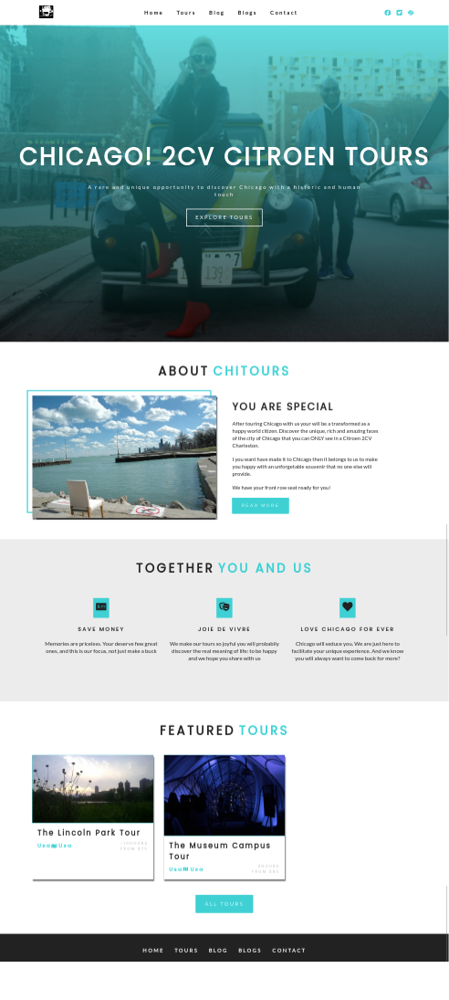

# North Pond Photo Gallery - Portfolio

## About

The goal of this project is to support the efforts to protect and revive the parks around the North Pond.
This project also include photography projects that I have done in the neighborhood and abroad over many years.

Finally, I included a portolio page to showcase some of my web development works.

[See the live project](https://northpond365-360.vercel.app/)


## Repo usage

First, clone repo and install the dependencies of this project:

```
npm install
```

Add an `.env` file containing the read-only API token of your DatoCMS site:

```
echo 'DATO_API_TOKEN=abc123' >> .env
```

Then, to run this website in development mode (with live-reload):

```
npm run develop
```

To build the final, production ready static website:

```
npm run build
```

The final result will be saved in the `public` directory.

You can find further information about how to integrate DatoCMS with Gatsby in [DatoCMS documentation](https://www.datocms.com/docs/static-generators/gatsbyjs).

